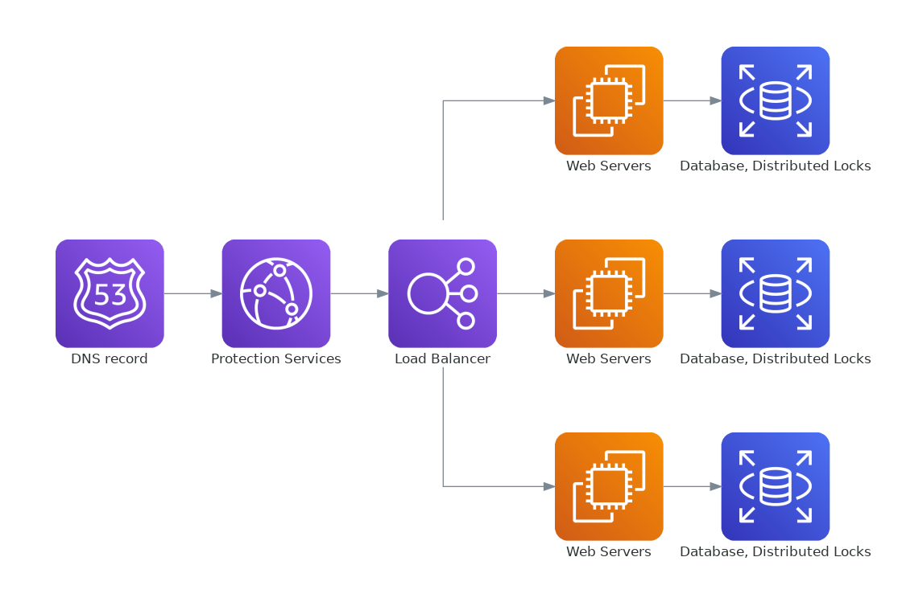

# Preface

A Deep Linking system is effectively a URL shortener that redirects based on configuration and requester attributes, such as operating system. An API+SDK is used to provide the same user experience even if the app/game wasn't installed yet. Fingerprinting, tracking, and analytics are used throughout the process.

I've done by best given my limited knowledge. Deep Linking is a topic I'll continue to learn about in the coming days.

# Solution

Leveraging AWS shortens time-to-value and may simplify our architecture. Budget constraints are only lightly considered.

## Components

* DynamoDB for our database
* DynamoDB for handling distributed lock management (aka single source of truth)
* Docker containers for our servers. AWS Lambda is an alternative if our application is simple.
    * I don't know the latency characteristics of lambda but I would find out before choosing it
* Kubernetes for running & scaling our services (if not using lambda). Elastic Container Service (ECS) can be used instead but has different trade-offs
* Elastic Load Balancing (ELB) to distribute requests across our servers
* Cloudflare for anti-bot & DDoS protection services

Shown with 3 web servers, databases, etc. For 100M+ users there would be many more.

## Example Flow

### Example Flow in Details

1. A 3rd Party app development studio creates a Deep Link using our platform
    * They provide URLs for iOS, Android, and Desktop
    * Optionally they provide a custom short URL, which our service checks for uniqueness
    * Otherwise our service provides a random-looking short URL, taken from a list of known-available IDs
    * An entry is created in our database, with the public (short) URL as the key
    * The link is now ready to use

1. A user visits the link
    * (if we need) Our system will serve a tiny javascript asset to help identify the user and installed apps. We may leverage existing tools such as fingerprintjs
    * The js client sends that data back to our servers
    * Our server may combine payload & headers data to uniquely identify the user. We save UserID + url data into the database

1.  Our server returns HTTP 302 Found:
    * The Location header contains one of the URLs configured in step 1. For example:
    * On mobile, the returned URL is handled by Android/iOS where it will launch the app/game and pass it the URL. The app parses the URL to open the desired content (ie: start a lobby and invite several players)
    * On desktop, we direct to content on our website. It's possible to open a desktop application as well, but the mechanism required is different. The same result is possible, where an application is launched and directly opens some content or connects to a game lobby

1. If the mobile app was not installed:
    * The redirect would open their mobile app store
    * The user would (hopefully) install and open the app/game

1. Upon opening the app:
    * Calculate a unique user ID using the same logic as during the redirect. It must generate the same UserID
    * The app makes an API call using UserID + app name (hard-coded in app). It finds the entry we created during the redirect
    * The API returns the same URL the app would/did receive during the initial redirect. The app/game again opens the desired content (ie: joining a game lobby)

## Databases

### URLs

* key'd by full URL (arguably not including protocol or query params)
* Data: redirect URLs. Other data as needed for tracking, analytics, etc

### Users + app

* short-lived data. Tuple of UserID + app (could be domain from URL), needed when "passing" a URL to an app after installation
* We could decided to keep this data for analytics or billing purposes (ie: a free tier that allows 10,000 requests, after which the customer is charged)

# Risks

* Availability. If our services are unavailable then links won't work at all. This is the worst user experience, so we must to everything to avoid outages
* Complexity. Maintaining and improving our service will require talented (and often expensive) workers. Onboarding new employees will take time. With good company policies and employee retention practices we can mitigate this risk.
* Dependence. We rely on Amazon services. If they doubled their prices, we'd have to pay. This is always a risk when building systems on another company's platform. Our customers take this risk when choosing our Deep Linking platform.

## Disclaimer

I am not an expert in Deep Linking. Any code or instructions in this repo are provided AS-IS with absolutely not warranty either expressed or implied. You are using these materials at your own risk.
